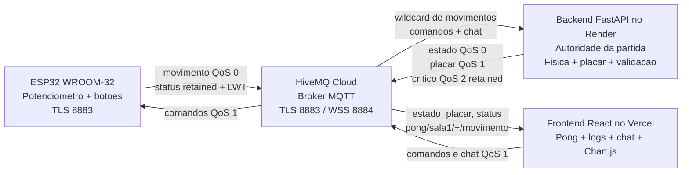
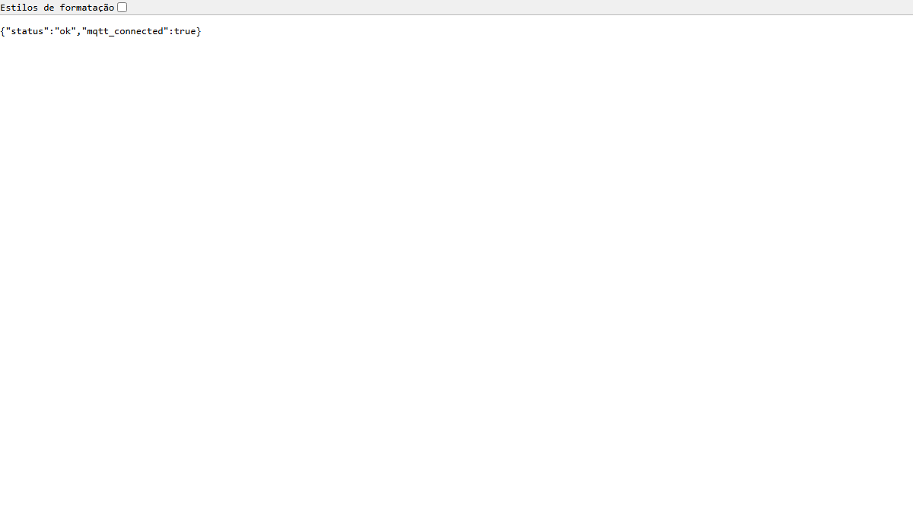
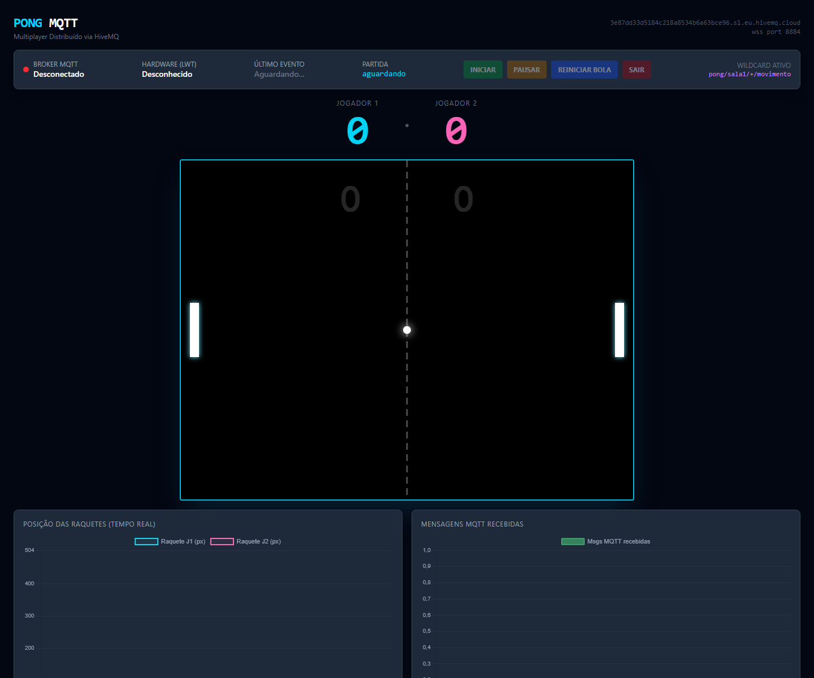
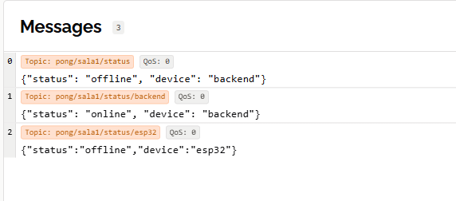
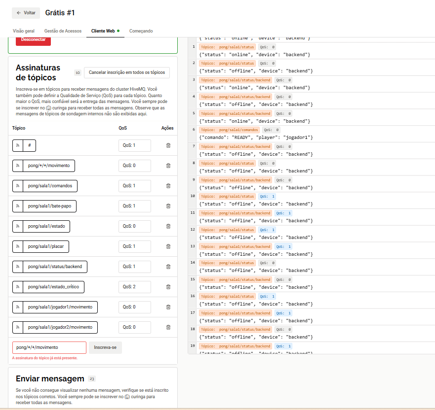

# Pong Multiplayer Distribuido via MQTT

Jogo de Pong em tempo real no qual um ESP32 fisico controla as raquetes e
troca mensagens com um backend Python e uma interface React pelo HiveMQ Cloud.

## Links da entrega

- Aplicacao publicada: https://pong-front.vercel.app/
- Backend e Swagger: https://pong-mqtt-backend.onrender.com/docs
- Saude do backend: https://pong-mqtt-backend.onrender.com/health
- Repositorio publico: https://github.com/Gorgommel/Pong
- Apresentacao: [`apresentacao/Pong-MQTT-Apresentacao.pptx`](apresentacao/Pong-MQTT-Apresentacao.pptx)
- Roteiro de fala: [`apresentacao/ROTEIRO.md`](apresentacao/ROTEIRO.md)

## Integrantes

> Preencher antes da entrega: nome completo e RA de todos os integrantes.

| Nome completo | RA |
|---|---|
| Amanda Lima Gonçalves Martins| Desenvolvedora |
| Heloisa Silva Lino | Desenvolvedora |
| Igor Filipi | Desenvolvedor |
| Isaac -Silva Morais | Desenvolvedor |

## Tema escolhido

**Tema 3 - Jogo Multiplayer Distribuido.** O ESP32 publica movimentos das
raquetes; o backend centraliza fisica, colisao e placar; o frontend exibe o
jogo, publica comandos e visualiza mensagens MQTT em tempo real.

## Arquitetura e fluxo

O arquivo editavel original esta em
[`evidencias/arquitetura-pong.drawio`](evidencias/arquitetura-pong.drawio).



Fluxo principal:

1. O potenciometro e lido pelo ESP32 e convertido na posicao da raquete.
2. O ESP32 publica o movimento no HiveMQ Cloud.
3. O backend recebe pelo wildcard, valida e atualiza o estado oficial.
4. O backend calcula bola, colisoes e placar e publica os resultados.
5. O frontend recebe as mensagens e atualiza jogo, graficos, logs e status.
6. Frontend e botoes fisicos publicam comandos como `READY`, `PAUSE` e `EXIT`.

## Topicos MQTT

| Topico | QoS | Retained | Publica | Assina | Funcao |
|---|---:|---|---|---|---|
| `pong/sala1/jogador1/movimento` | 0 | Nao | ESP32 | Backend e Frontend | Posicao da raquete J1 |
| `pong/sala1/jogador2/movimento` | 0 | Nao | ESP32 | Backend e Frontend | Posicao da raquete J2 |
| `pong/+/+/movimento` | 0 | Nao | - | Backend | Wildcard global de movimentos |
| `pong/sala1/+/movimento` | 0 | Nao | - | Frontend | Wildcard restrito da sala |
| `pong/sala1/estado` | 0 | Nao | Backend | Frontend | Bola e raquetes em tempo real |
| `pong/sala1/placar` | 1 | Nao | Backend | Frontend | Placar confiavel |
| `pong/sala1/comandos` | 1 | Nao | Frontend/ESP32 | Backend/ESP32 | READY, PAUSE, RESUME, RESET_BALL e EXIT |
| `pong/sala1/chat` | 1 | Nao | Frontend | Backend/Frontend | Chat MQTT |
| `pong/sala1/status/+` | 1 | Sim | ESP32/Backend | Frontend | Online/offline, retained e LWT |
| `pong/sala1/estado_critico` | 2 | Sim | Backend | Frontend | Ultimo evento critico |

### Justificativa dos niveis QoS

- **QoS 0:** movimentos e estado sao frequentes. Perder um frame e melhor que
  atrasar os seguintes com retransmissoes.
- **QoS 1:** placar, comandos, status e chat precisam chegar. Comandos possuem
  `command_id` para ignorar duplicatas.
- **QoS 2:** eventos criticos sao raros e devem ser processados exatamente uma
  vez.

### LWT e retained

- O ESP32 registra um LWT em `pong/sala1/status/esp32`. Se cair sem desconectar,
  o broker publica `offline`.
- Status e estado critico usam retained. Um cliente que acabou de abrir recebe
  imediatamente o ultimo estado conhecido.

## Tecnologias

- ESP32 WROOM-32, ArduinoJson, PubSubClient e WiFiClientSecure.
- HiveMQ Cloud com autenticacao separada e TLS.
- Python, FastAPI, Uvicorn e Paho MQTT no Render.
- React, Vite, MQTT.js e Chart.js no Vercel.
- GitHub para versionamento publico.

## Controles e validacao

- `READY`: inicia uma nova partida.
- `PAUSE` / `RESUME`: pausa e retoma somente em estados validos.
- `RESET_BALL`: centraliza a bola durante partida ativa.
- `EXIT`: encerra a partida.

Frontend e backend aceitam somente jogadores, comandos, topicos e payloads
esperados. Chat vazio, mensagens acima de 280 caracteres, caracteres de
controle, movimentos invalidos e comandos aleatorios sao rejeitados.

## Evidencias

### Deploy e broker na nuvem









Consulte [`evidencias/README.md`](evidencias/README.md) para a lista das fotos
fisicas e capturas que ainda devem ser adicionadas.

## Como executar localmente

Backend:

```powershell
cd pong-back
python -m venv .venv
.\.venv\Scripts\pip install -r requirements.txt
.\.venv\Scripts\python -m uvicorn pong_backend:app --host 0.0.0.0 --port 8000
```

Frontend:

```powershell
cd pong-front
npm install
npm run dev
```

Instrucoes completas de arquitetura, HiveMQ e ESP32:
[`pong-front/README.md`](pong-front/README.md). Guia de hospedagem:
[`DEPLOY.md`](DEPLOY.md).

## Checklist da rubrica

| Criterio | Estado | Evidencia |
|---|---|---|
| MQTT, topicos, wildcards, QoS, LWT e retained | Implementado | Codigo, tabela acima e HiveMQ |
| ESP32 fisico integrado | Implementado | Movimento publicado e status online; adicionar fotos fisicas |
| Interface web funcional | Implementado | Vercel, Pong, comandos, logs, chat e graficos |
| Broker na nuvem | Implementado | HiveMQ Cloud |
| Testes HiveMQ Web | Implementado | Capturas em `evidencias/` |
| Teste MQTT Explorer | Pendente de evidencia | Adicionar a captura solicitada |
| Deploy publico | Implementado | Links do Render e Vercel |
| Repositorio e documentacao | Implementado | GitHub, README e diagrama |
| Banco de dados | Nao implementado | Item extra, nao obrigatorio |
| Autenticacao/TLS | Implementado | Usuarios separados, TLS 8883 e WSS 8884 |
